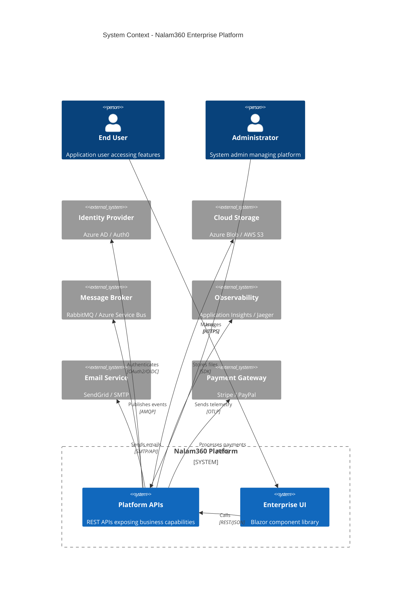
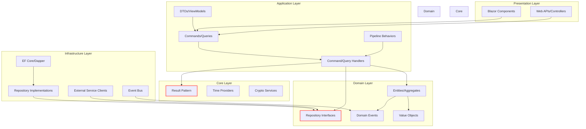
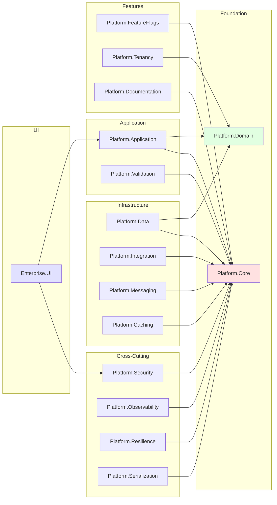
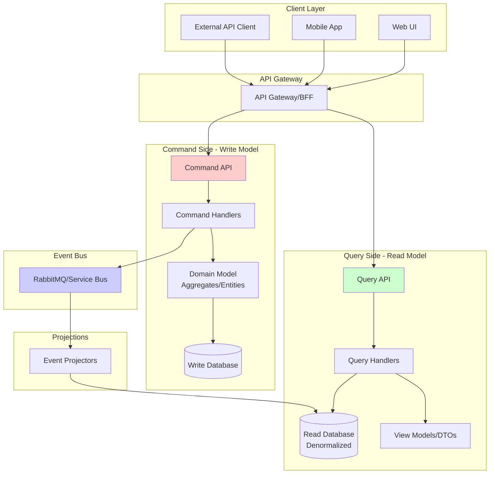
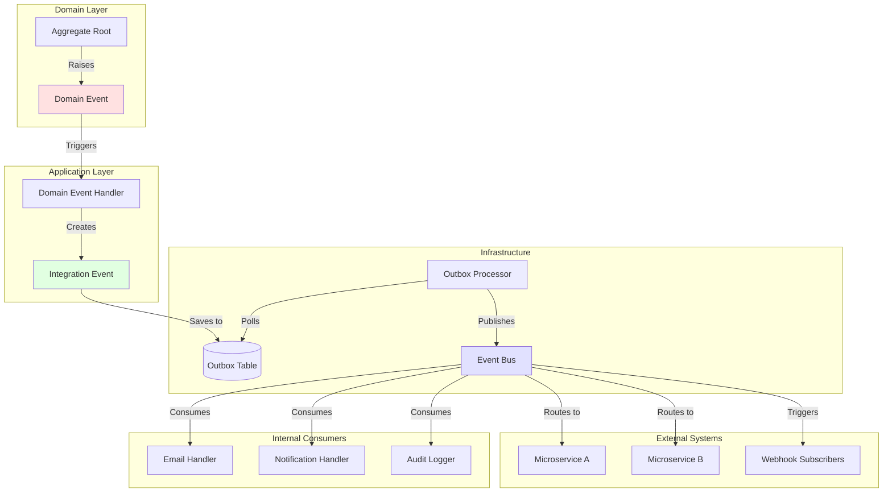
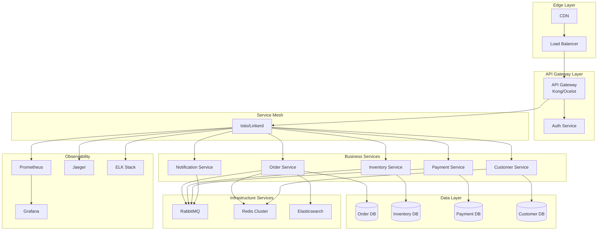
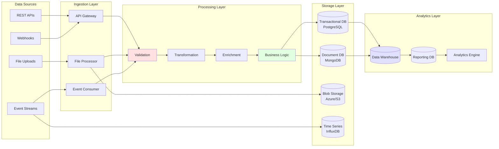
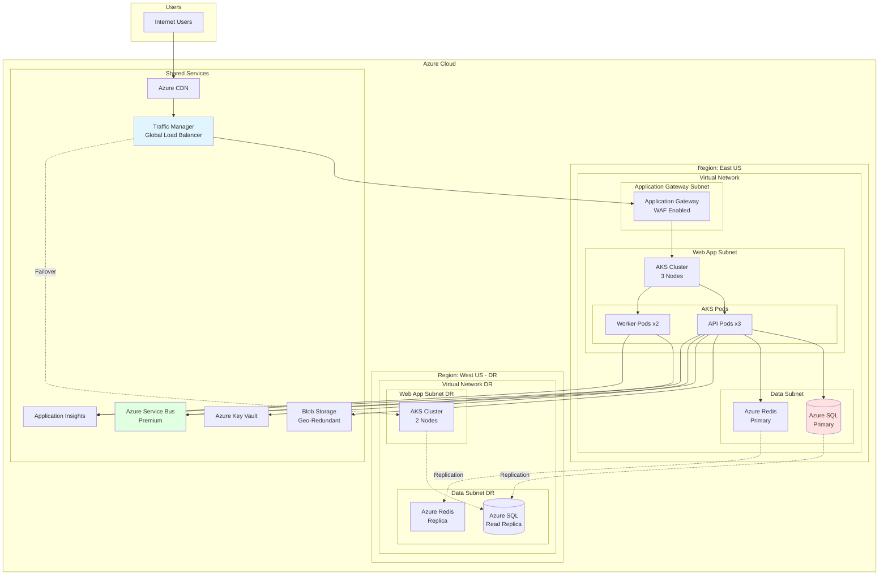

# Nalam360 Enterprise Platform - Architecture Diagrams

This document contains high-level architecture diagrams showing system structure, component relationships, and deployment patterns.

**Format:** Mermaid  
**Date:** November 18, 2025

---

## Table of Contents

1. [System Context Diagram](#1-system-context-diagram)
2. [Clean Architecture Layers](#2-clean-architecture-layers)
3. [Module Structure](#3-module-structure)
4. [CQRS Architecture](#4-cqrs-architecture)
5. [Event-Driven Architecture](#5-event-driven-architecture)
6. [Microservices Topology](#6-microservices-topology)
7. [Data Flow Architecture](#7-data-flow-architecture)
8. [Deployment Architecture](#8-deployment-architecture)

---

## 1. System Context Diagram

**Description:** High-level view of the platform and external systems.

---

## 2. Clean Architecture Layers

**Description:** Dependency flow in Clean Architecture with the Dependency Rule.

---

## 3. Module Structure

**Description:** Platform modules and their dependencies.

---

## 4. CQRS Architecture

**Description:** Command Query Responsibility Segregation pattern implementation.

---

## 5. Event-Driven Architecture

**Description:** Event flow from domain events to integration events and external systems.

---

## 6. Microservices Topology

**Description:** Microservices deployment with API gateway and service mesh.

---

## 7. Data Flow Architecture

**Description:** Data flow from external sources through processing to storage.

---

## 8. Deployment Architecture

**Description:** Cloud deployment on Azure with high availability.

---

## Usage Notes

### C4 Model

These diagrams follow the **C4 Model** principles:
- **Context**: System in environment
- **Container**: High-level technology choices
- **Component**: Internal structure
- **Code**: Class-level details (sequence diagrams)

### Deployment Considerations

The deployment architecture shows:
- **High Availability**: Multi-region deployment
- **Disaster Recovery**: Read replicas and failover
- **Scalability**: Kubernetes for horizontal scaling
- **Security**: WAF, Key Vault, VNet isolation
- **Observability**: Centralized monitoring and logging

### Customization

Adapt diagrams for your infrastructure:
- Swap Azure for AWS/GCP services
- Adjust scaling parameters
- Modify network topology
- Add/remove microservices

---

**Document Version:** 1.0  
**Last Updated:** November 18, 2025  
**Maintained By:** Nalam360 Platform Team
