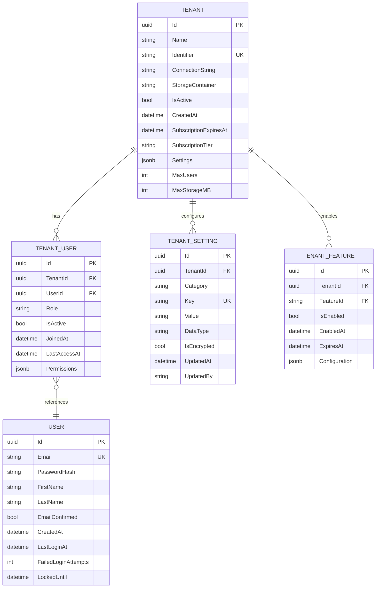
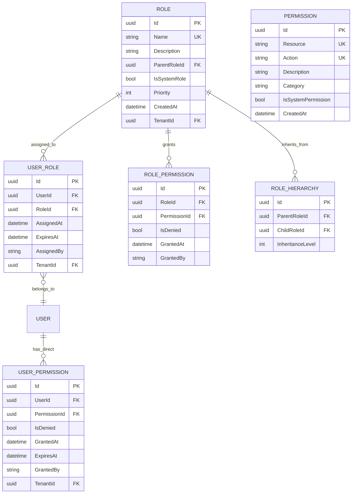
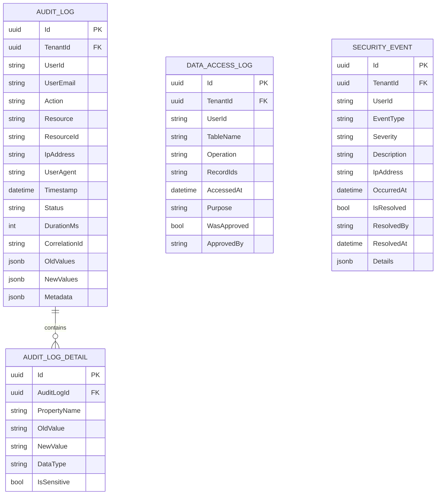
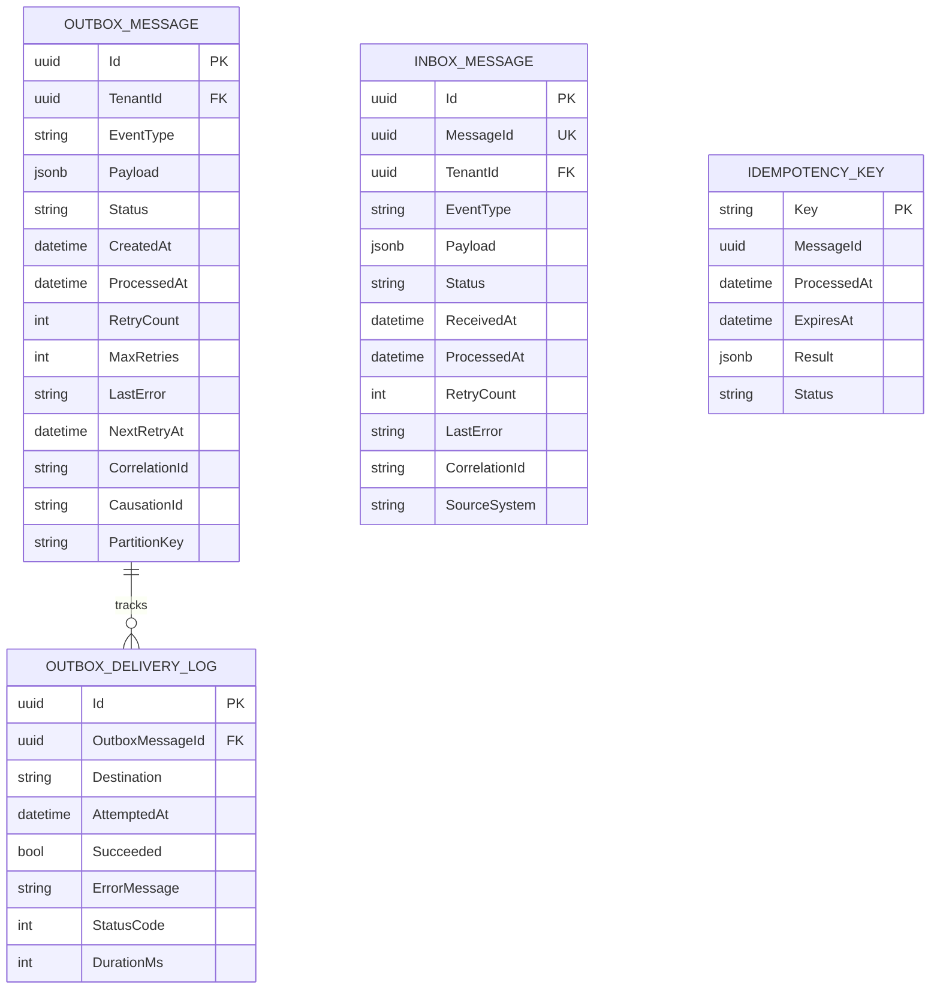
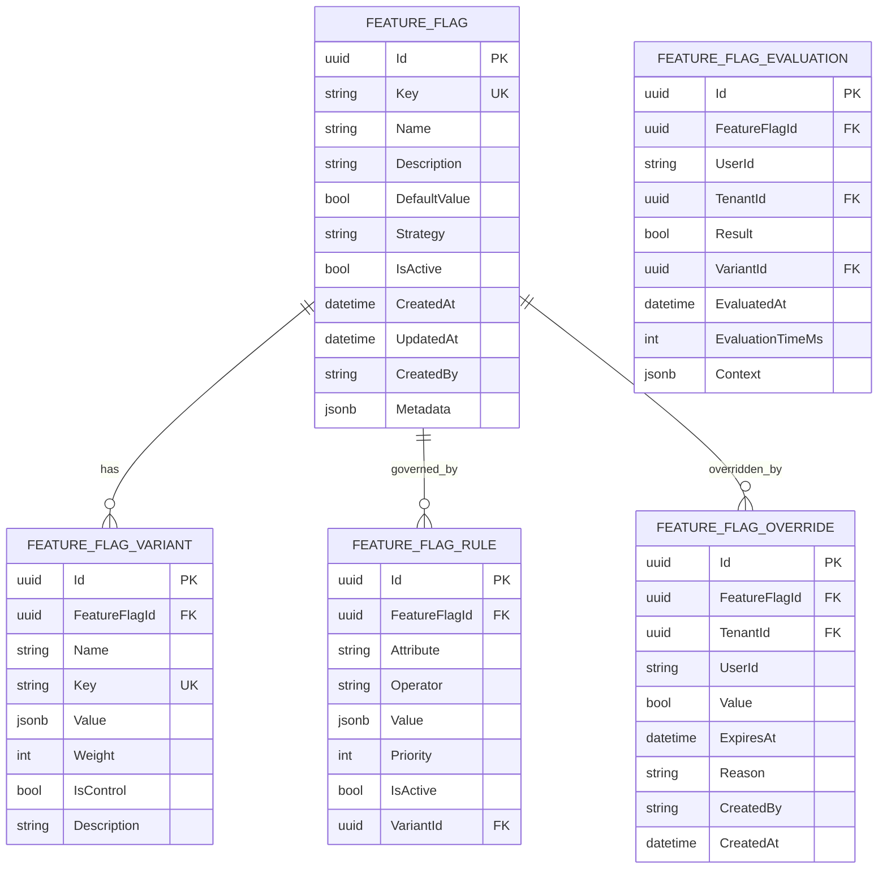
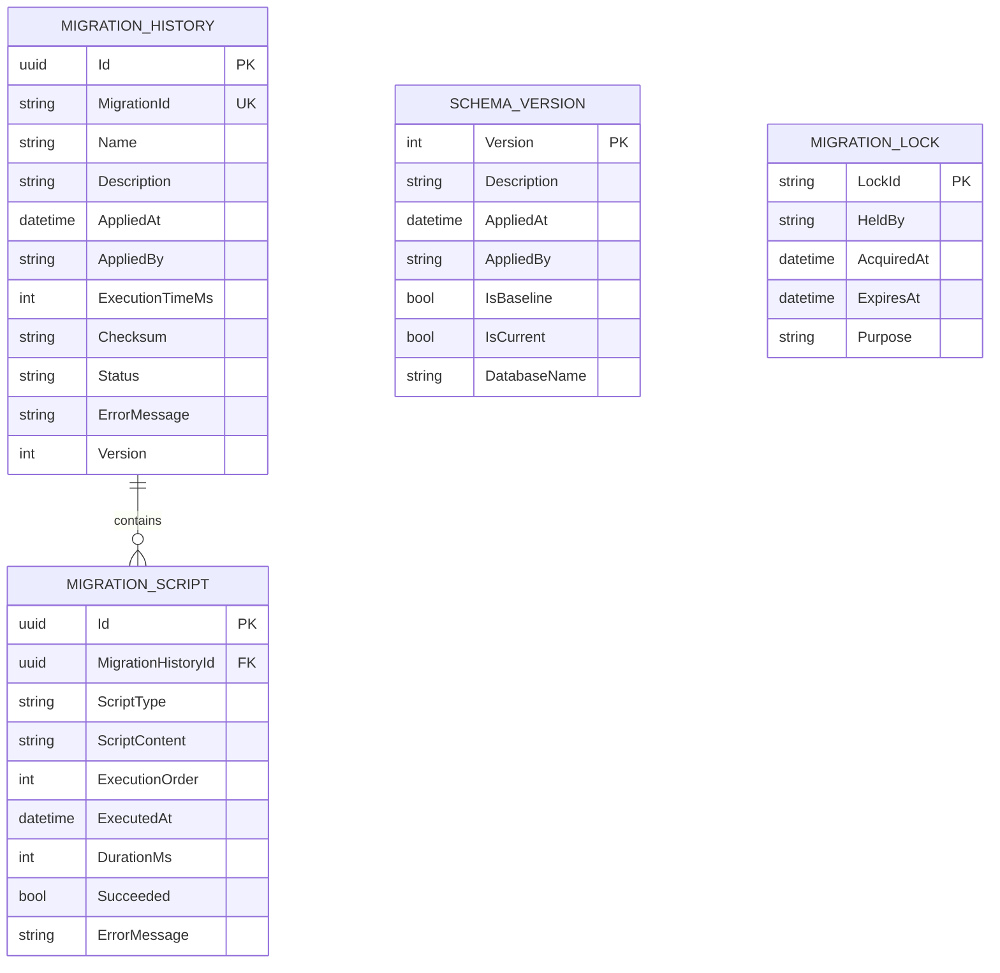

# Nalam360 Enterprise Platform - Database Schema Diagrams

This document contains Entity Relationship Diagrams (ERD) for the platform's core data models.

**Format:** Mermaid  
**Date:** November 18, 2025

---

## Table of Contents

1. [Core Domain Model](#1-core-domain-model)
2. [Multi-Tenancy Schema](#2-multi-tenancy-schema)
3. [RBAC Schema](#3-rbac-schema)
4. [Audit Log Schema](#4-audit-log-schema)
5. [Outbox Pattern Schema](#5-outbox-pattern-schema)
6. [Feature Flags Schema](#6-feature-flags-schema)
7. [Migration History Schema](#7-migration-history-schema)

---

## 1. Core Domain Model

**Description:** Generic domain entities showing common patterns.

```mermaid
erDiagram
    CUSTOMER ||--o{ ORDER : places
    CUSTOMER {
        uuid Id PK
        string Email UK
        string FirstName
        string LastName
        string PhoneNumber
        datetime CreatedAt
        datetime UpdatedAt
        uuid TenantId FK
        bool IsActive
        string ExternalId
    }
    
    ORDER ||--|{ ORDER_ITEM : contains
    ORDER {
        uuid Id PK
        uuid CustomerId FK
        string OrderNumber UK
        decimal TotalAmount
        string Status
        datetime OrderDate
        datetime ShippedDate
        datetime DeliveredDate
        string ShippingAddress
        uuid TenantId FK
        datetime CreatedAt
        datetime UpdatedAt
        string CreatedBy
        string UpdatedBy
    }
    
    ORDER_ITEM }o--|| PRODUCT : references
    ORDER_ITEM {
        uuid Id PK
        uuid OrderId FK
        uuid ProductId FK
        int Quantity
        decimal UnitPrice
        decimal LineTotal
        decimal DiscountAmount
        int LineNumber
    }
    
    PRODUCT {
        uuid Id PK
        string SKU UK
        string Name
        string Description
        decimal Price
        int StockQuantity
        bool IsActive
        uuid CategoryId FK
        uuid TenantId FK
        datetime CreatedAt
        datetime UpdatedAt
    }
    
    PRODUCT }o--|| CATEGORY : belongs_to
    CATEGORY {
        uuid Id PK
        string Name
        string Code UK
        string Description
        uuid ParentCategoryId FK
        int DisplayOrder
        uuid TenantId FK
    }
```



---

## 2. Multi-Tenancy Schema

**Description:** Schema for multi-tenant isolation and configuration.



---

## 3. RBAC Schema

**Description:** Role-Based Access Control with hierarchical roles and permissions.



---

## 4. Audit Log Schema

**Description:** Comprehensive audit trail for compliance and security.



---

## 5. Outbox Pattern Schema

**Description:** Transactional outbox for reliable event publishing.



---

## 6. Feature Flags Schema

**Description:** Feature flag configuration with targeting and rollout strategies.



---

## 7. Migration History Schema

**Description:** Database migration tracking and versioning.



---

## Schema Design Principles

### 1. Audit Trail
All entities include:
- `CreatedAt`, `UpdatedAt` timestamps
- `CreatedBy`, `UpdatedBy` user tracking
- Soft delete with `IsActive` flag

### 2. Multi-Tenancy
Every business entity includes:
- `TenantId` for data isolation
- Global query filters auto-applied
- Connection string per tenant (optional)

### 3. Concurrency
- `RowVersion` (timestamp) for optimistic locking
- Unique constraints on business keys
- Foreign keys with cascade rules

### 4. Performance
- Indexes on foreign keys
- Composite indexes for common queries
- Partitioning by `TenantId` or date
- Archival strategy for old data

### 5. Security
- Encrypted columns for PII
- Row-level security policies
- Audit all data access
- No cascading deletes for critical data

---

## Migration Strategy

### Schema Versioning
```
V1__Initial_Schema.sql
V2__Add_Tenancy.sql
V3__Add_Audit_Logs.sql
V4__Add_Feature_Flags.sql
```

### Naming Conventions
- Tables: `PascalCase`
- Columns: `PascalCase`
- Primary Keys: `Id`
- Foreign Keys: `{Table}Id`
- Indexes: `IX_{Table}_{Column}`
- Constraints: `CK_{Table}_{Column}`

---

**Document Version:** 1.0  
**Last Updated:** November 18, 2025  
**Maintained By:** Nalam360 Platform Team
