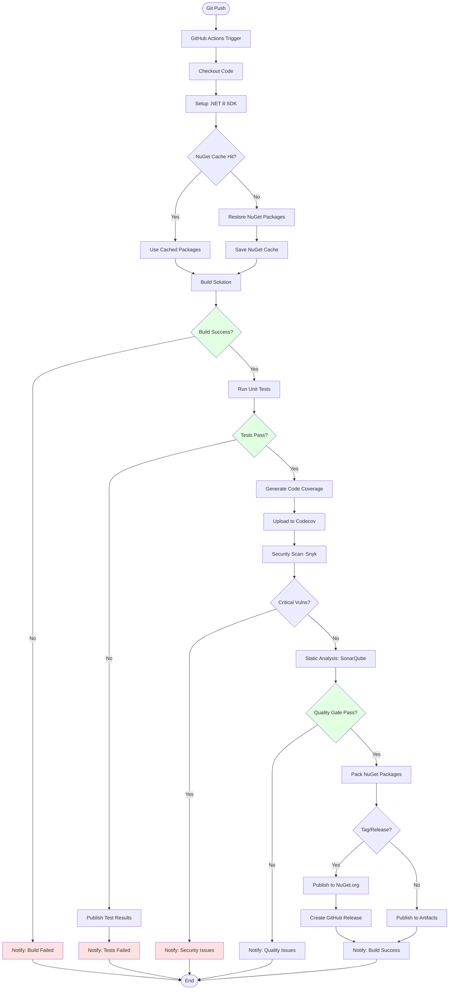
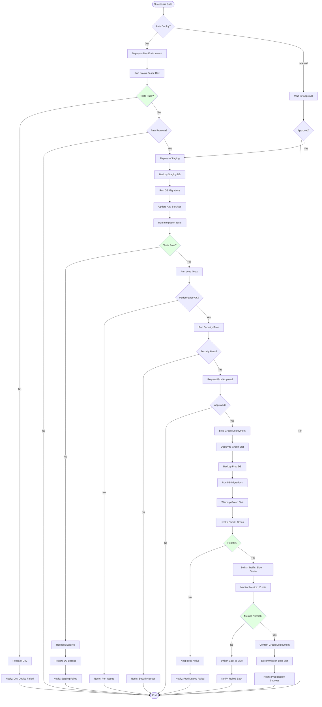
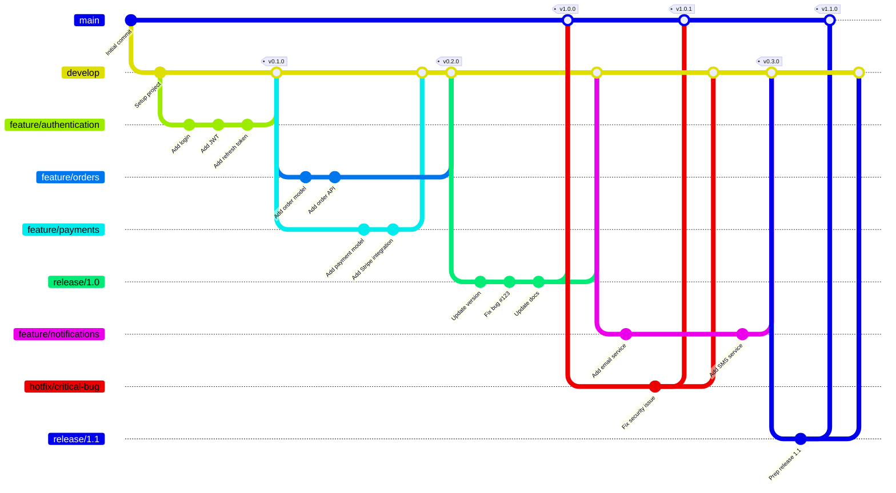
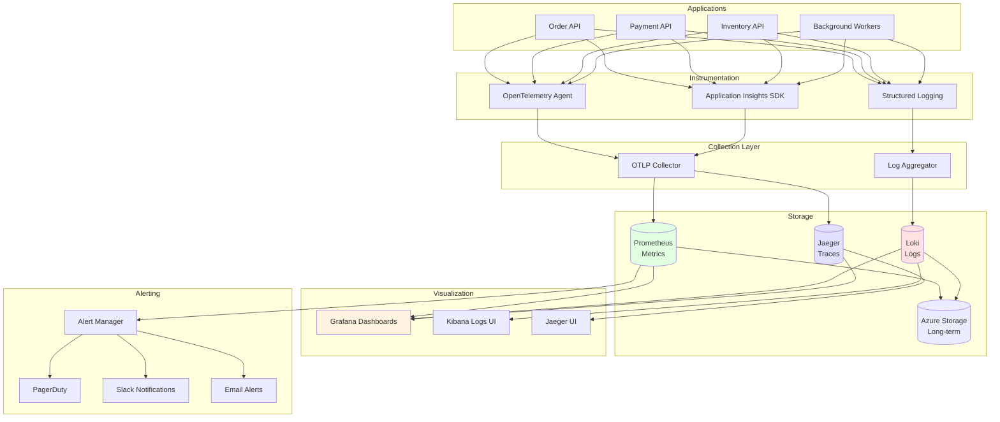
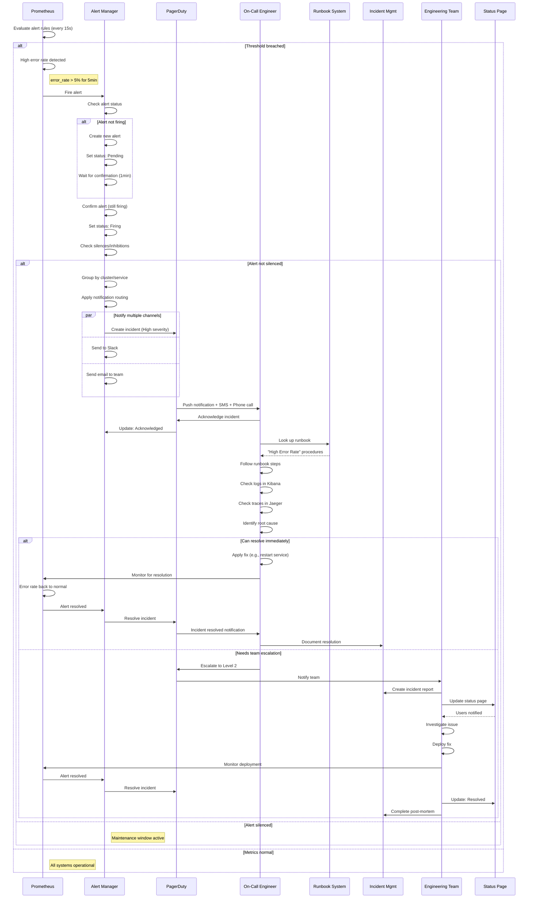
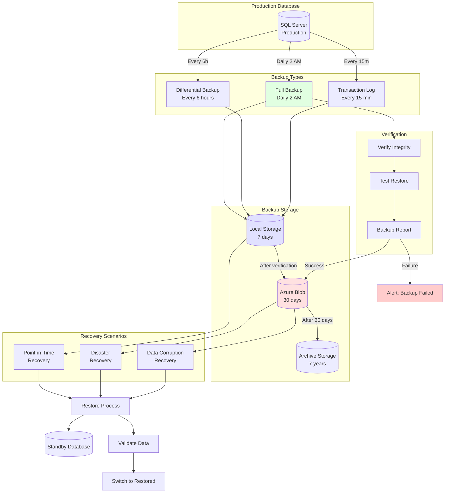
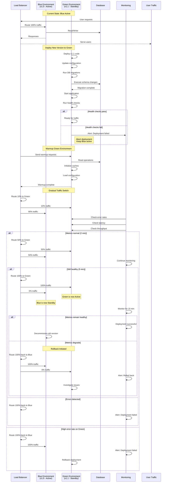

# Nalam360 Enterprise Platform - DevOps & Operations Diagrams

This document contains diagrams for CI/CD pipelines, monitoring, deployment strategies, and operational workflows.

**Format:** Mermaid  
**Date:** November 18, 2025

---

## Table of Contents

1. [CI Build Pipeline](#1-ci-build-pipeline)
2. [CD Deployment Pipeline](#2-cd-deployment-pipeline)
3. [GitFlow Workflow](#3-gitflow-workflow)
4. [Monitoring Architecture](#4-monitoring-architecture)
5. [Alerting & Incident Response](#5-alerting--incident-response)
6. [Backup & Recovery](#6-backup--recovery)
7. [Blue-Green Deployment](#7-blue-green-deployment)
8. [Disaster Recovery](#8-disaster-recovery)

---

## 1. CI Build Pipeline

**Description:** Continuous Integration pipeline with build, test, security scan, and artifact publishing.

---

## 2. CD Deployment Pipeline

**Description:** Continuous Deployment with multi-environment promotion and automated rollback.

---

## 3. GitFlow Workflow

**Description:** Branching strategy with feature branches, releases, and hotfixes.

---

## 4. Monitoring Architecture

**Description:** Comprehensive observability stack with metrics, logs, and traces.

---

## 5. Alerting & Incident Response

**Description:** Alert lifecycle from detection to resolution with escalation.

---

## 6. Backup & Recovery

**Description:** Automated backup strategy with point-in-time recovery.

---

## 7. Blue-Green Deployment

**Description:** Zero-downtime deployment with traffic switching.

---

## 8. Disaster Recovery

**Description:** DR failover process with multi-region redundancy.

```mermaid
sequenceDiagram
    participant Primary as Primary Region<br/>(East US)
    participant PrimaryDB as Primary Database
    participant Monitor as Monitoring
    participant DR as DR Region<br/>(West US)
    participant DRDB as DR Database<br/>(Read Replica)
    participant TrafficMgr as Traffic Manager
    participant DBA as DBA Team
    participant Incident as Incident Mgmt

    Note over Primary,Incident: Normal Operations
    
    Primary->>PrimaryDB: Read/Write operations
    PrimaryDB->>DRDB: Continuous replication
    Note right of DRDB: Async replication<br/>< 5 second lag
    
    Monitor->>Primary: Health check (every 30s)
    Primary-->>Monitor: Healthy
    
    Note over Primary,Incident: Disaster Scenario: Region Failure
    
    Monitor->>Primary: Health check
    Note right of Primary: Timeout / No response
    
    Monitor->>Monitor: Retry health check (3 attempts)
    Monitor->>Primary: Health check (retry 1)
    Monitor->>Primary: Health check (retry 2)
    Monitor->>Primary: Health check (retry 3)
    
    alt All retries failed
        Monitor->>Monitor: Region failure detected
        Monitor->>Incident: Create P1 incident
        Monitor->>DBA: Alert on-call DBA
        Monitor->>TrafficMgr: Primary unhealthy
        
        DBA->>DBA: Assess situation
        DBA->>PrimaryDB: Check database status
        
        alt Database unreachable
            DBA->>DBA: Confirm region failure
            DBA->>Incident: Declare disaster
            
            Note over DBA,DRDB: Initiate DR Failover
            
            DBA->>DRDB: Stop replication
            DRDB->>DRDB: Promote to primary
            DRDB->>DRDB: Enable writes
            
            DBA->>DR: Update connection strings
            DR->>DR: Point to DRDB
            DR->>DR: Scale up instances
            
            DBA->>TrafficMgr: Switch to DR region
            TrafficMgr->>TrafficMgr: Update DNS
            Note right of TrafficMgr: TTL: 60 seconds
            
            TrafficMgr->>DR: Route traffic
            DR->>DRDB: Read/Write operations
            
            DBA->>Monitor: Update health checks
            Monitor->>DR: Health check
            DR-->>Monitor: Healthy
            
            DBA->>Incident: Update: Failed over to DR
            DBA->>DBA: Notify stakeholders
        end
    end
    
    Note over Primary,Incident: Recovery: Primary Region Restored
    
    Primary->>Primary: Region comes back online
    Monitor->>Primary: Health check
    Primary-->>Monitor: Healthy
    
    Monitor->>DBA: Alert: Primary region restored
    
    DBA->>DBA: Assess recovery options
    
    alt Failback to primary
        DBA->>PrimaryDB: Restore from backup
        DBA->>DRDB: Export recent transactions
        DRDB-->>DBA: Transaction log
        
        DBA->>PrimaryDB: Apply transaction log
        PrimaryDB->>PrimaryDB: Verify data consistency
        
        DBA->>Primary: Update configuration
        Primary->>PrimaryDB: Connect to primary DB
        
        DBA->>TrafficMgr: Plan traffic switch
        
        Note over DBA,TrafficMgr: Gradual Failback
        
        TrafficMgr->>TrafficMgr: Route 10% to Primary
        Monitor->>Primary: Monitor metrics
        
        alt Metrics healthy (10 min)
            TrafficMgr->>TrafficMgr: Route 50% to Primary
            Monitor->>Monitor: Continue monitoring
            
            alt Still healthy (10 min)
                TrafficMgr->>TrafficMgr: Route 100% to Primary
                
                DBA->>DRDB: Reconfigure as read replica
                PrimaryDB->>DRDB: Resume replication
                
                DBA->>Incident: Close incident
                DBA->>DBA: Schedule post-mortem
            else Issues detected
                TrafficMgr->>TrafficMgr: Route back to DR
                DBA->>DBA: Investigate issues
            end
        else Primary unstable
            TrafficMgr->>TrafficMgr: Keep DR as primary
            DBA->>DBA: Continue investigation
        end
    else Stay on DR
        DBA->>DR: Confirm permanent operation
        DBA->>DRDB: Optimize for production
        DBA->>Primary: Investigate root cause
    end
```

---

## DevOps Best Practices

### 1. CI/CD Pipeline
- **Fast feedback**: Keep builds under 10 minutes
- **Fail fast**: Run quick tests first
- **Parallel execution**: Run independent tasks in parallel
- **Artifact caching**: Cache dependencies and build outputs
- **Security scanning**: Integrate into pipeline, not after

### 2. Deployment Strategy
- **Blue-green**: Zero downtime, instant rollback
- **Canary**: Gradual rollout with metrics validation
- **Feature flags**: Decouple deployment from release
- **Database migrations**: Backward compatible, test thoroughly
- **Rollback plan**: Always have a rollback strategy

### 3. Monitoring
- **Four golden signals**: Latency, traffic, errors, saturation
- **Distributed tracing**: Trace requests across services
- **Structured logging**: Use structured logs (JSON)
- **Metrics retention**: 15 days detailed, 1 year aggregated
- **Alert fatigue**: Tune alerts, avoid false positives

### 4. Incident Management
- **Runbooks**: Document common issues and fixes
- **On-call rotation**: Fair rotation, reasonable shifts
- **Escalation path**: Clear escalation procedures
- **Post-mortems**: Blameless, focus on systems
- **Status page**: Keep customers informed

### 5. Backup & Recovery
- **3-2-1 rule**: 3 copies, 2 media types, 1 offsite
- **Test restores**: Test quarterly at minimum
- **Encryption**: Encrypt backups at rest and in transit
- **Retention**: Match business and regulatory requirements
- **Automation**: Automate backup and verification

### 6. Disaster Recovery
- **RTO/RPO**: Define recovery time and point objectives
- **Regular drills**: Test DR procedures quarterly
- **Documentation**: Keep runbooks updated
- **Communication**: Have out-of-band communication
- **Multi-region**: Deploy to multiple regions

### 7. Security
- **Secrets management**: Never commit secrets to Git
- **Least privilege**: Minimal permissions for services
- **Network security**: Use private subnets, NSGs
- **Vulnerability scanning**: Scan dependencies regularly
- **Compliance**: Maintain SOC2, ISO certifications

### 8. Cost Optimization
- **Right-sizing**: Match resources to actual needs
- **Auto-scaling**: Scale based on demand
- **Reserved capacity**: Use for predictable workloads
- **Spot instances**: Use for fault-tolerant workloads
- **Cost monitoring**: Track and alert on spending

---

## Operational Runbooks

### High CPU Usage
1. Check application logs for errors
2. Review slow query logs
3. Check for memory leaks
4. Scale horizontally if needed
5. Investigate code hotspots

### Database Connection Pool Exhausted
1. Check active connections
2. Look for long-running queries
3. Identify connection leaks in code
4. Increase pool size temporarily
5. Fix application code

### High Latency
1. Check downstream service health
2. Review database query performance
3. Check cache hit rates
4. Look for network issues
5. Enable more aggressive caching

### Deployment Failure
1. Check build logs for errors
2. Verify database migrations
3. Check configuration differences
4. Review resource health
5. Rollback if needed

---

**Document Version:** 1.0  
**Last Updated:** November 18, 2025  
**Maintained By:** Nalam360 Platform Team
