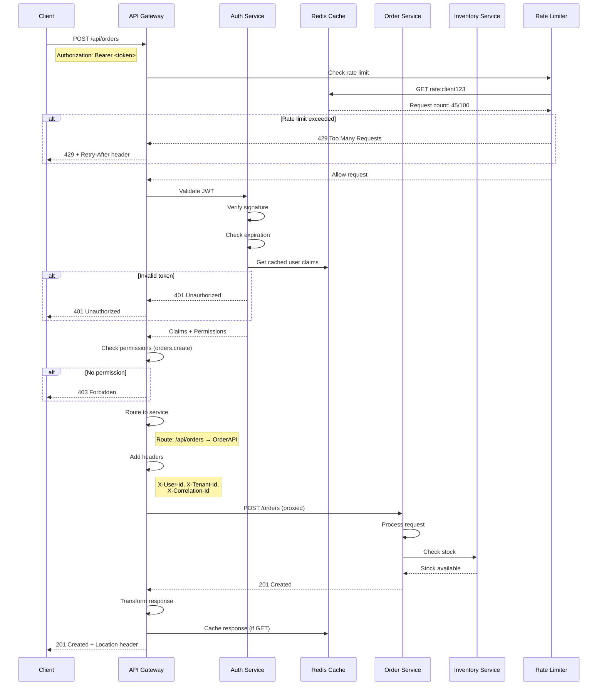
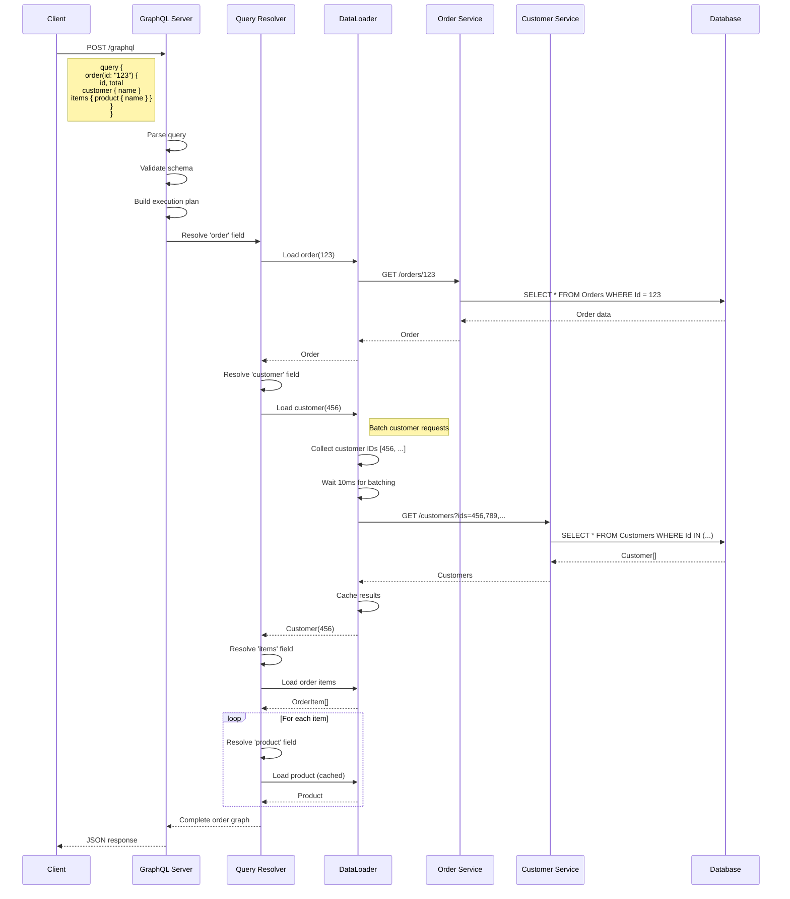
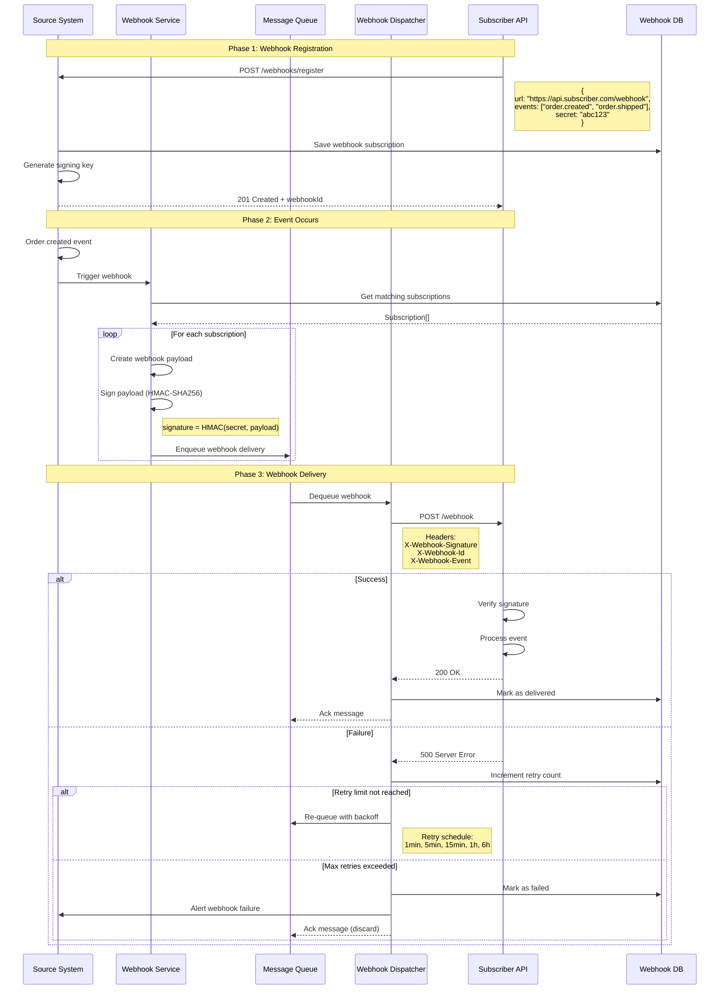
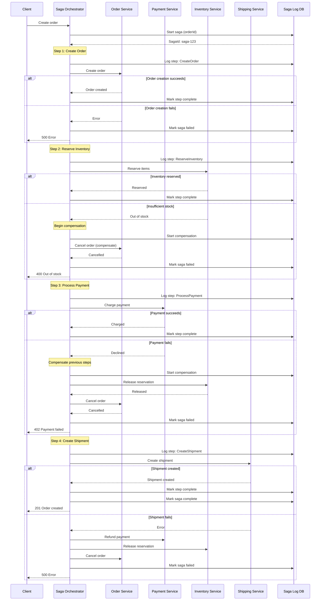
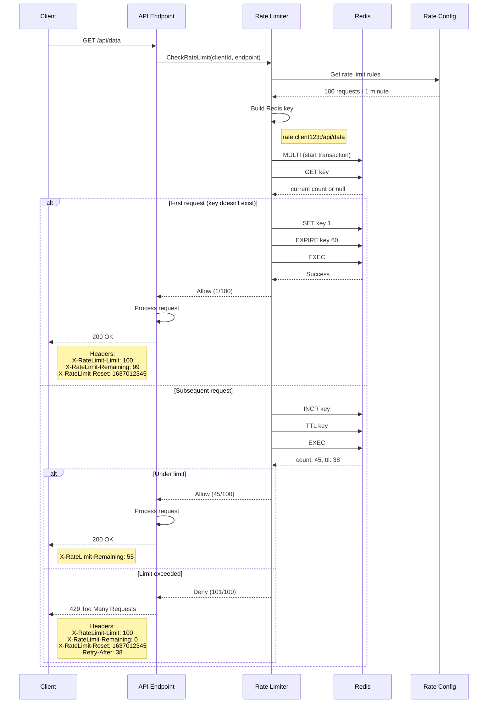
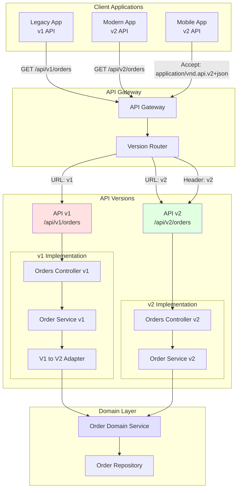
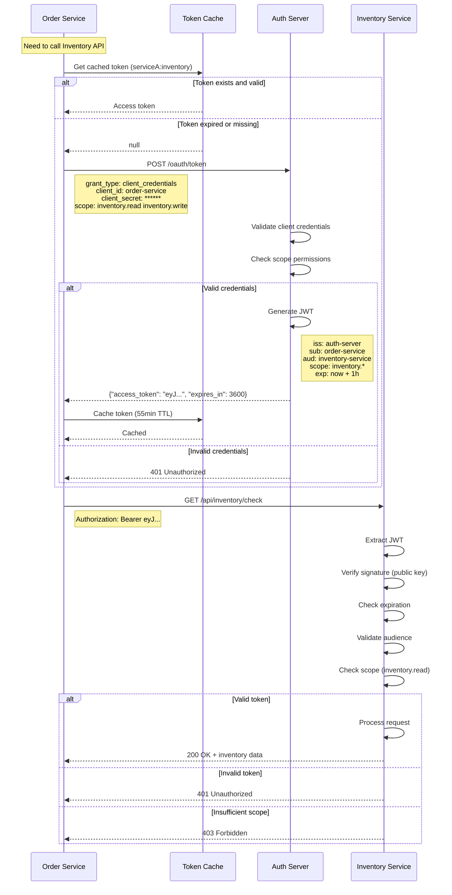

# Nalam360 Enterprise Platform - Integration Patterns Diagrams

This document contains diagrams for API integration patterns, message-driven integration, and inter-service communication.

**Format:** Mermaid  
**Date:** November 18, 2025

---

## Table of Contents

1. [REST API Gateway Pattern](#1-rest-api-gateway-pattern)
2. [GraphQL API Integration](#2-graphql-api-integration)
3. [Webhook Integration](#3-webhook-integration)
4. [Message Bus Integration](#4-message-bus-integration)
5. [Saga Pattern for Distributed Transactions](#5-saga-pattern-for-distributed-transactions)
6. [API Rate Limiting](#6-api-rate-limiting)
7. [API Versioning Strategies](#7-api-versioning-strategies)
8. [Service-to-Service Authentication](#8-service-to-service-authentication)

---

## 1. REST API Gateway Pattern

**Description:** Centralized API gateway for routing, authentication, and rate limiting.



---

## 2. GraphQL API Integration

**Description:** GraphQL API with query batching and dataloader pattern.



---

## 3. Webhook Integration

**Description:** Webhook registration, delivery, and retry mechanism.



---

## 4. Message Bus Integration

**Description:** Publish-subscribe messaging with topic routing.

```mermaid
graph TB
    subgraph "Publishers"
        OrderService[Order Service]
        PaymentService[Payment Service]
        InventoryService[Inventory Service]
    end
    
    subgraph "Message Broker"
        Exchange[Topic Exchange<br/>"events.exchange"]
        
        subgraph "Queues"
            OrderQueue[order.events]
            EmailQueue[email.notifications]
            AuditQueue[audit.logs]
            AnalyticsQueue[analytics.events]
        end
    end
    
    subgraph "Subscribers"
        EmailService[Email Service]
        AuditService[Audit Service]
        AnalyticsService[Analytics Service]
        WarehouseService[Warehouse Service]
    end
    
    OrderService -->|"order.created"| Exchange
    OrderService -->|"order.shipped"| Exchange
    PaymentService -->|"payment.completed"| Exchange
    InventoryService -->|"inventory.low"| Exchange
    
    Exchange -->|"order.*"| OrderQueue
    Exchange -->|"#"| EmailQueue
    Exchange -->|"#"| AuditQueue
    Exchange -->|"*.completed"| AnalyticsQueue
    
    OrderQueue --> WarehouseService
    EmailQueue --> EmailService
    AuditQueue --> AuditService
    AnalyticsQueue --> AnalyticsService
    
    style Exchange fill:#e1e1ff
    style OrderQueue fill:#ffe1e1
    style EmailQueue fill:#ffe1e1
    style AuditQueue fill:#ffe1e1
    style AnalyticsQueue fill:#ffe1e1
```

---

## 5. Saga Pattern for Distributed Transactions

**Description:** Orchestration saga for multi-service transactions with compensation.



---

## 6. API Rate Limiting

**Description:** Token bucket rate limiting with Redis.



---

## 7. API Versioning Strategies

**Description:** API versioning approaches for backward compatibility.



---

## 8. Service-to-Service Authentication

**Description:** OAuth2 client credentials flow for machine-to-machine auth.



---

## Integration Best Practices

### 1. REST API Design
- Use HTTP methods correctly (GET, POST, PUT, DELETE)
- Return appropriate status codes (2xx, 4xx, 5xx)
- Include pagination for collections
- Support filtering, sorting, field selection
- Version APIs from day one

### 2. GraphQL Design
- Use DataLoader to prevent N+1 queries
- Implement query complexity limits
- Set reasonable timeout and depth limits
- Provide clear error messages
- Use subscriptions for real-time updates

### 3. Webhooks
- Always sign payloads (HMAC-SHA256)
- Implement exponential backoff retry
- Set reasonable timeout (10-30s)
- Support webhook testing endpoints
- Log all delivery attempts

### 4. Messaging
- Use idempotency keys
- Implement dead letter queues
- Set appropriate message TTL
- Use message deduplication
- Monitor queue depth

### 5. Saga Pattern
- Log every saga step
- Design compensating transactions
- Handle partial failures gracefully
- Set step timeouts
- Implement saga recovery

### 6. Rate Limiting
- Use distributed rate limiting (Redis)
- Implement per-user and per-IP limits
- Return clear rate limit headers
- Provide upgrade paths for limits
- Monitor rate limit violations

### 7. Versioning
- Support multiple versions simultaneously
- Deprecate old versions gradually (6-12 months)
- Document breaking changes clearly
- Use semantic versioning
- Provide migration guides

### 8. Service Auth
- Use short-lived tokens (1 hour)
- Cache tokens appropriately
- Rotate client secrets regularly
- Use separate credentials per service
- Audit all service-to-service calls

---

**Document Version:** 1.0  
**Last Updated:** November 18, 2025  
**Maintained By:** Nalam360 Platform Team
