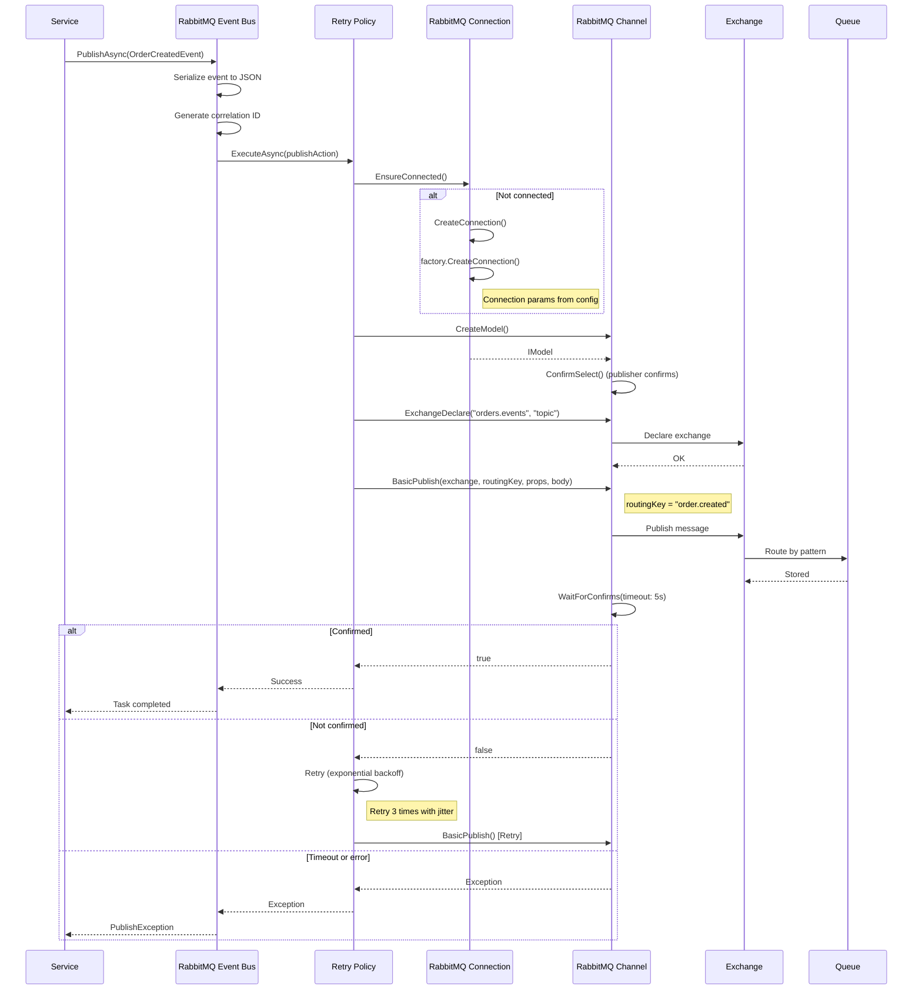

# Nalam360 Enterprise Platform - Architecture Sequence Diagrams

This document contains comprehensive sequence diagrams illustrating the key architectural flows and patterns used in the Nalam360 Enterprise Platform.

**Total Diagrams:** 15  
**Format:** Mermaid  
**Date:** November 18, 2025

---

## Table of Contents

1. [CQRS Command Flow](#1-cqrs-command-flow)
2. [CQRS Query Flow](#2-cqrs-query-flow)
3. [Domain Event Dispatch](#3-domain-event-dispatch)
4. [Repository Pattern](#4-repository-pattern)
5. [Unit of Work Pattern](#5-unit-of-work-pattern)
6. [Messaging with Outbox Pattern](#6-messaging-with-outbox-pattern)
7. [RabbitMQ Event Publishing](#7-rabbitmq-event-publishing)
8. [Circuit Breaker Pattern](#8-circuit-breaker-pattern)
9. [Feature Flag Evaluation](#9-feature-flag-evaluation)
10. [RBAC Authorization Flow](#10-rbac-authorization-flow)
11. [Database Migration Execution](#11-database-migration-execution)
12. [Validation Pipeline](#12-validation-pipeline)
13. [Cloud Storage Upload](#13-cloud-storage-upload)
14. [Distributed Tracing](#14-distributed-tracing)
15. [Multi-Tenancy Resolution](#15-multi-tenancy-resolution)

---

## 1. CQRS Command Flow

**Description:** Shows how a command flows through the mediator pipeline with validation and logging behaviors before reaching the handler.

---

## 2. CQRS Query Flow

**Description:** Demonstrates query execution with optional caching and specifications.

---

## 3. Domain Event Dispatch

**Description:** Shows how domain events are collected from aggregates and dispatched after persistence.

---

## 4. Repository Pattern

**Description:** Generic repository with specification pattern for complex queries.

---

## 5. Unit of Work Pattern

**Description:** Transactional coordination with automatic entity tracking and domain event dispatch.

---

## 6. Messaging with Outbox Pattern

**Description:** Transactional outbox pattern ensuring reliable message delivery.

---

## 7. RabbitMQ Event Publishing

**Description:** Publishing events to RabbitMQ with retry logic and confirmations.

---

## 8. Circuit Breaker Pattern

**Description:** Polly circuit breaker protecting external service calls.

---

## 9. Feature Flag Evaluation

**Description:** Feature flag evaluation with percentage rollout and user targeting.

---

## 10. RBAC Authorization Flow

**Description:** Role-based access control with permission inheritance and claim transformation.

---

## 11. Database Migration Execution

**Description:** Database migration with transaction support and rollback capability.

---

## 12. Validation Pipeline

**Description:** FluentValidation and attribute validation in the CQRS pipeline.

---

## 13. Cloud Storage Upload

**Description:** File upload to Azure Blob Storage with SAS URL generation.

---

## 14. Distributed Tracing

**Description:** OpenTelemetry distributed tracing across microservices.

---

## 15. Multi-Tenancy Resolution

**Description:** Tenant resolution and data isolation in a multi-tenant application.

---

## Diagram Usage Guide

### Rendering Diagrams

These diagrams use **Mermaid** syntax and can be rendered in:

1. **GitHub/GitLab** - Native support in markdown files
2. **VS Code** - Install "Markdown Preview Mermaid Support" extension
3. **Online** - Copy to https://mermaid.live/
4. **Documentation Sites** - Docusaurus, MkDocs, etc.

### Customization

Modify diagrams by:
- Adding/removing participants
- Changing interaction flows
- Adding notes for clarity
- Adjusting alternative (alt) and parallel (par) blocks

### Best Practices

1. **Keep it focused** - One main flow per diagram
2. **Add notes** - Explain complex logic inline
3. **Use alternatives** - Show success/failure paths
4. **Highlight key decisions** - Use colored notes or boxes
5. **Keep participants minimal** - Only essential actors

---

**Document Version:** 1.0  
**Last Updated:** November 18, 2025  
**Maintained By:** Nalam360 Platform Team
