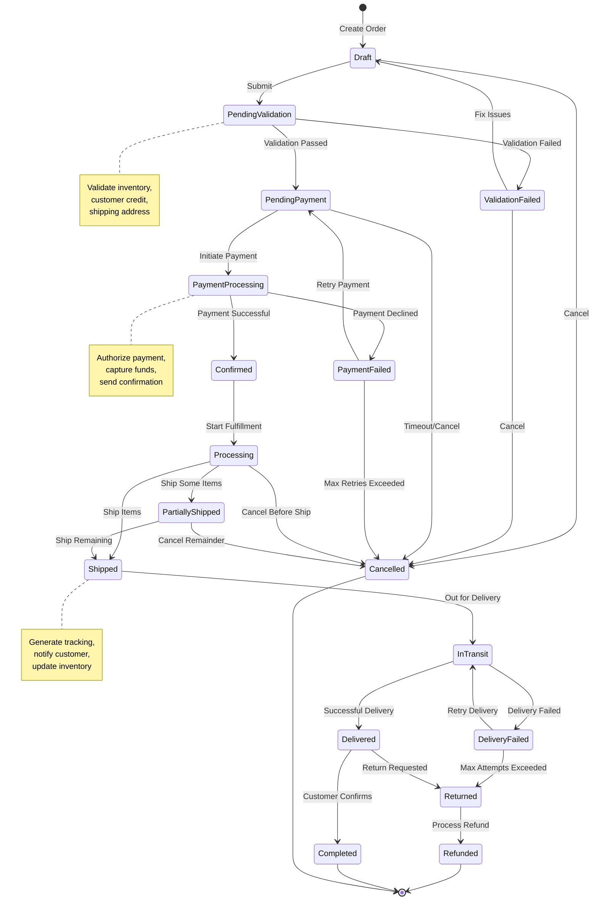
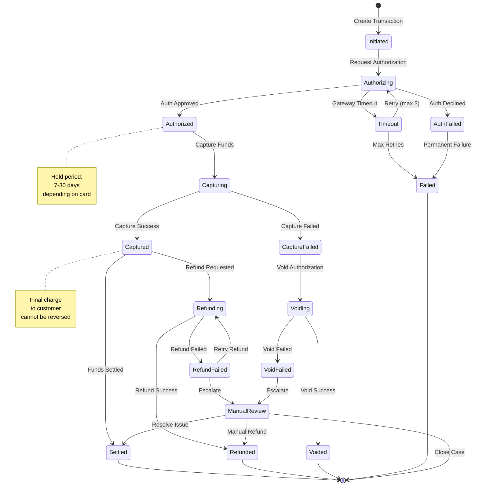
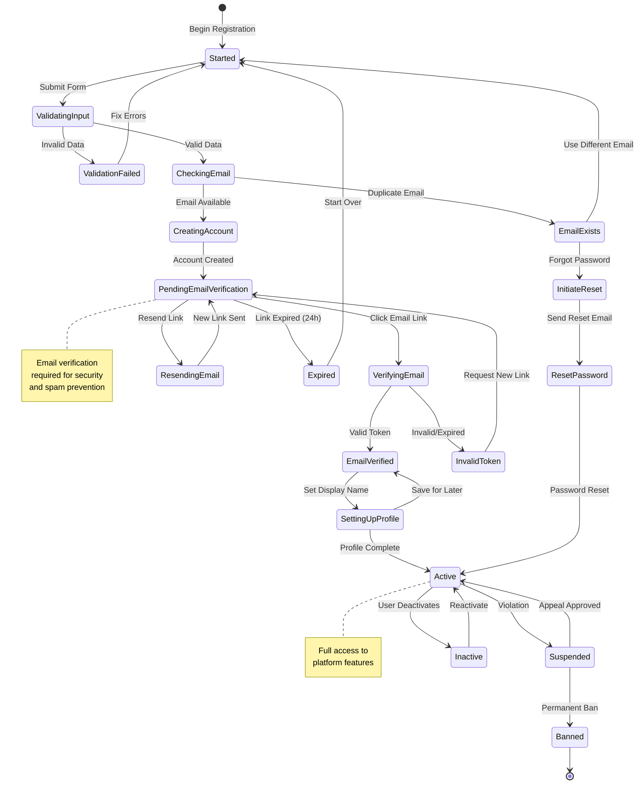
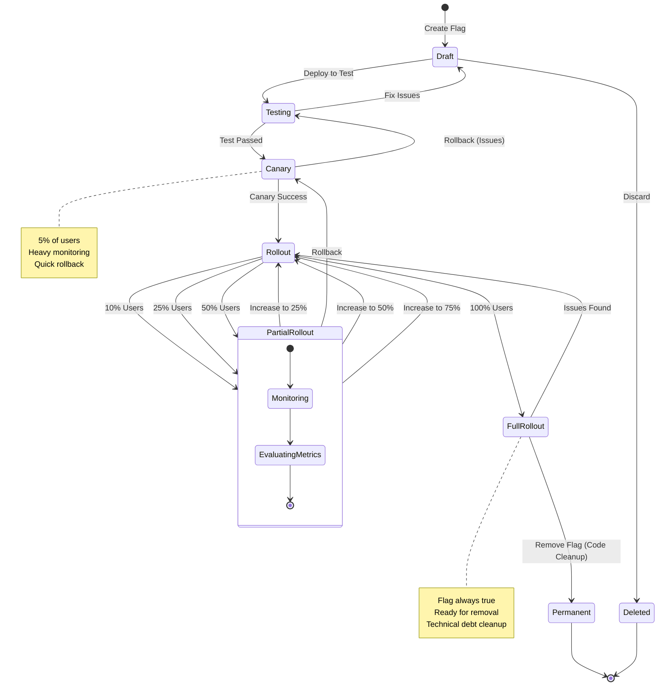
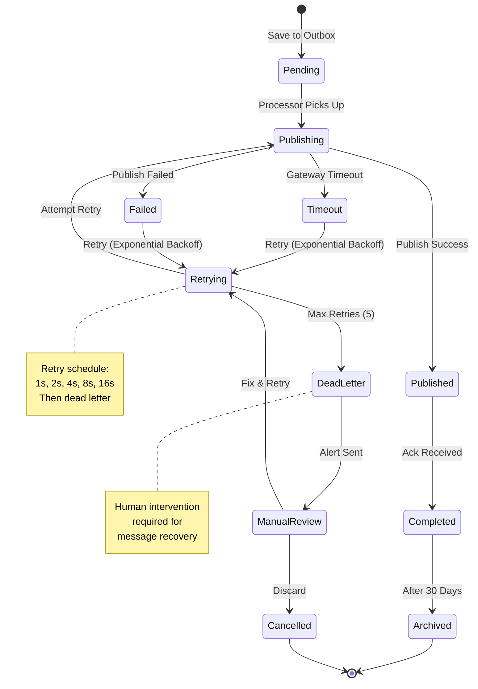
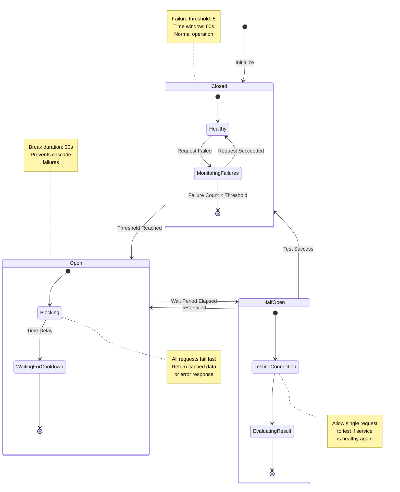
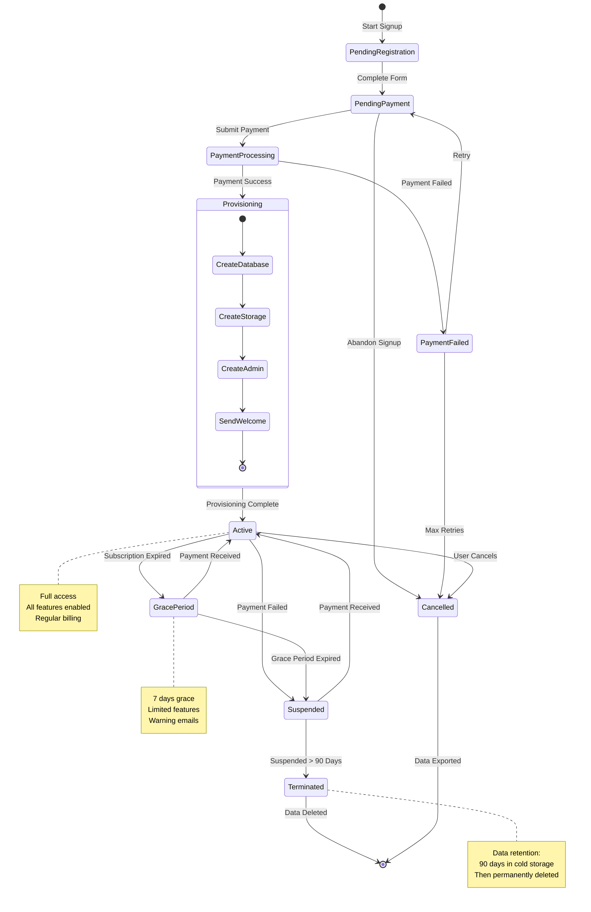

# Nalam360 Enterprise Platform - State Machine Diagrams

This document contains state transition diagrams for key business processes and workflows.

**Format:** Mermaid  
**Date:** November 18, 2025

---

## Table of Contents

1. [Order Lifecycle](#1-order-lifecycle)
2. [Payment Processing](#2-payment-processing)
3. [User Registration](#3-user-registration)
4. [Feature Flag Lifecycle](#4-feature-flag-lifecycle)
5. [Outbox Message Processing](#5-outbox-message-processing)
6. [Circuit Breaker States](#6-circuit-breaker-states)
7. [Tenant Activation](#7-tenant-activation)

---

## 1. Order Lifecycle

**Description:** State transitions for order processing from creation to completion.



---

## 2. Payment Processing

**Description:** Payment transaction state machine with retry logic.



---

## 3. User Registration

**Description:** User account creation and activation flow.



---

## 4. Feature Flag Lifecycle

**Description:** Feature flag rollout and retirement process.



---

## 5. Outbox Message Processing

**Description:** Reliable message delivery with retry logic.



---

## 6. Circuit Breaker States

**Description:** Circuit breaker pattern state transitions for resilience.



---

## 7. Tenant Activation

**Description:** Tenant onboarding and subscription lifecycle.



---

## State Transition Rules

### General Principles

1. **Explicit Transitions**: Every state change must be explicit and intentional
2. **Event-Driven**: State changes triggered by events (commands, time, external signals)
3. **Idempotent**: Multiple identical events should not cause issues
4. **Audited**: All state transitions logged with timestamp, user, and reason
5. **Reversible**: Critical states allow rollback (within constraints)

### Implementation Pattern

```csharp
public class OrderStateMachine
{
    public Result<Order> TransitionTo(OrderStatus targetStatus, Order order)
    {
        if (!CanTransitionTo(order.Status, targetStatus))
            return Result.Failure<Order>(
                Error.Validation("Invalid state transition"));
        
        var previousStatus = order.Status;
        order.Status = targetStatus;
        
        order.AddDomainEvent(new OrderStatusChangedEvent(
            order.Id, previousStatus, targetStatus));
        
        return Result.Success(order);
    }
    
    private bool CanTransitionTo(OrderStatus from, OrderStatus to)
    {
        return _validTransitions[from].Contains(to);
    }
}
```

---

**Document Version:** 1.0  
**Last Updated:** November 18, 2025  
**Maintained By:** Nalam360 Platform Team
