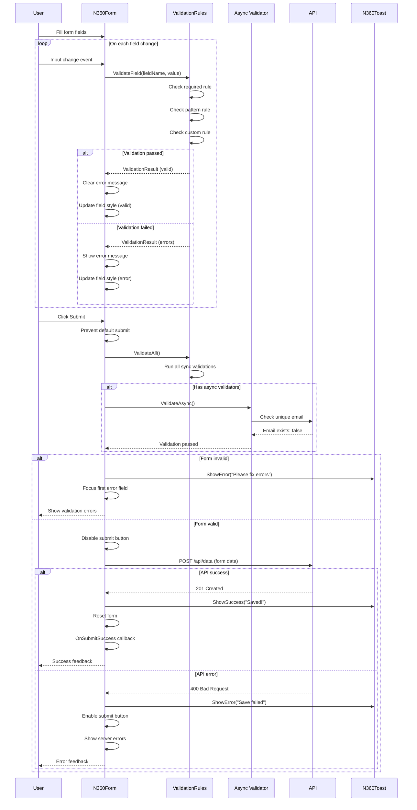
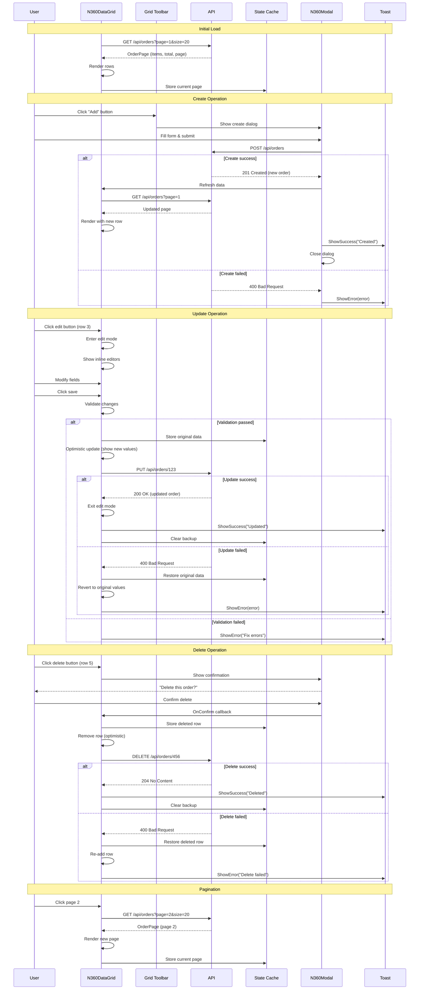
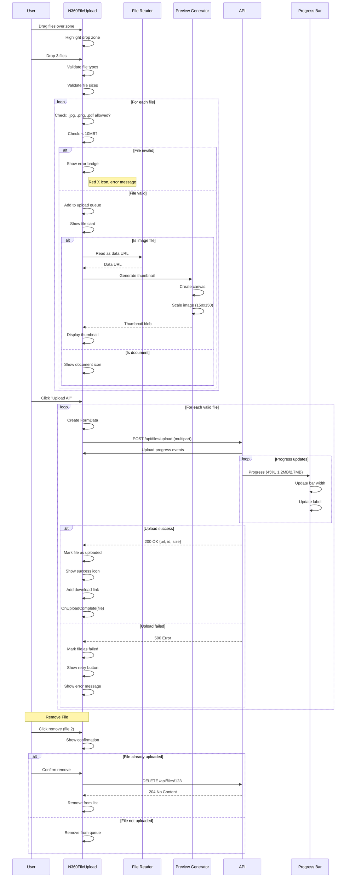
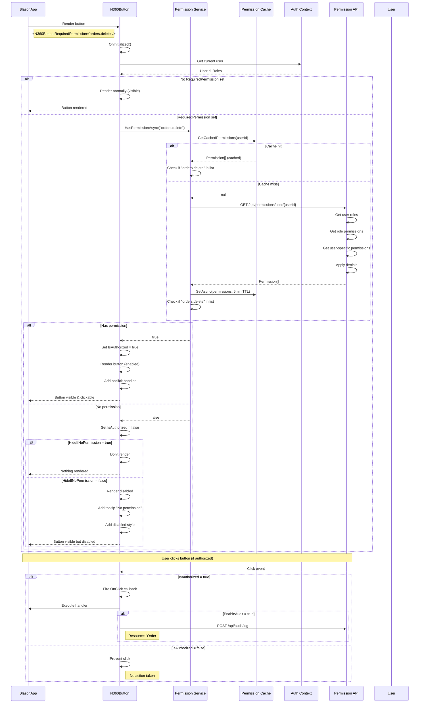
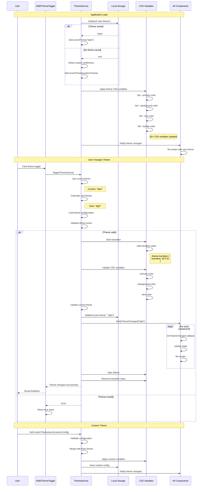
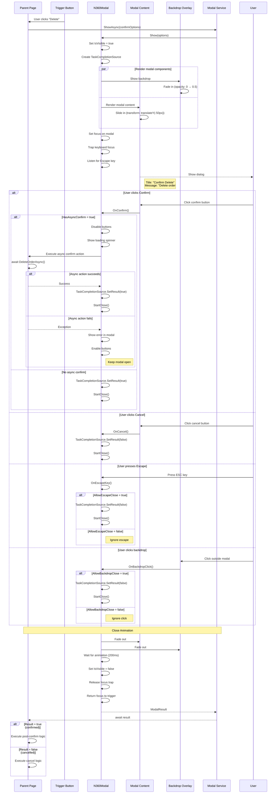
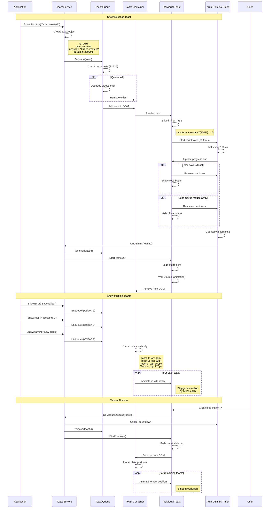
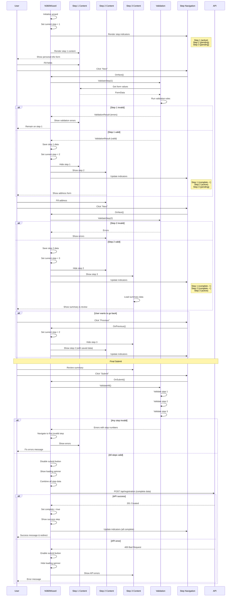
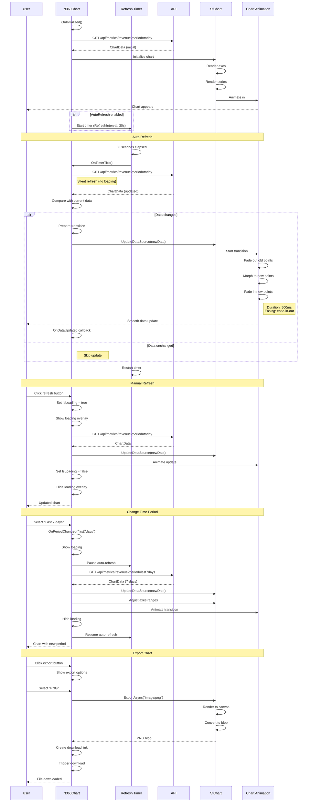

# Nalam360 Enterprise Platform - UI Component Flow Diagrams

This document contains interaction diagrams for Blazor UI components showing validation, data binding, and permission flows.

**Format:** Mermaid  
**Date:** November 18, 2025

---

## Table of Contents

1. [Form Validation Flow](#1-form-validation-flow)
2. [Data Grid CRUD Operations](#2-data-grid-crud-operations)
3. [File Upload with Preview](#3-file-upload-with-preview)
4. [Permission-Based Rendering](#4-permission-based-rendering)
5. [Theme Switching](#5-theme-switching)
6. [Modal Dialog Flow](#6-modal-dialog-flow)
7. [Autocomplete Search](#7-autocomplete-search)
8. [Notification System](#8-notification-system)
9. [Wizard Component](#9-wizard-component)
10. [Chart Data Refresh](#10-chart-data-refresh)

---

## 1. Form Validation Flow

**Description:** Multi-stage validation in N360Form with schema-driven rules and async validation.

---

## 2. Data Grid CRUD Operations

**Description:** N360DataGrid with server-side operations, inline editing, and optimistic updates.

---

## 3. File Upload with Preview

**Description:** N360FileUpload with drag-drop, preview generation, and progress tracking.

---

## 4. Permission-Based Rendering

**Description:** N360Button with RBAC permission checks and conditional rendering.

---

## 5. Theme Switching

**Description:** ThemeService managing dynamic theme changes with CSS variable updates.

---

## 6. Modal Dialog Flow

**Description:** N360Modal with async confirmation and result handling.

---

## 7. Autocomplete Search

**Description:** N360Autocomplete with debounced server search and keyboard navigation.

```mermaid
sequenceDiagram
    participant User
    participant Input as N360Autocomplete
    participant Debouncer as Debounce Timer
    participant API
    participant Cache as Search Cache
    participant Dropdown as Results Dropdown

    User->>Input: Focus input
    Input->>Input: Show search icon
    Input->>Dropdown: Prepare dropdown (hidden)
    
    User->>Input: Type "john"
    
    loop For each keystroke
        Input->>Input: Update input value
        Input->>Debouncer: Reset timer
        Debouncer->>Debouncer: Start 300ms countdown
        
        alt User types again (within 300ms)
            User->>Input: Type next char
            Input->>Debouncer: Cancel previous timer
            Debouncer->>Debouncer: Restart 300ms countdown
        end
    end
    
    Debouncer->>Debouncer: 300ms elapsed (no more typing)
    Debouncer->>Input: Trigger search
    
    Input->>Input: Get search term: "john"
    Input->>Input: Validate min length (3 chars)
    
    alt Term too short
        Input->>Dropdown: Hide
        Input-->>User: Show "Type at least 3 chars"
    else Term valid
        Input->>Cache: CheckCache("john")
        
        alt Cache hit
            Cache-->>Input: Cached results
            Input->>Dropdown: Show results
            Dropdown-->>User: Display 5 items
        else Cache miss
            Input->>Input: Show loading spinner
            Input->>API: GET /api/users/search?q=john
            
            API->>API: Execute search query
            API-->>Input: UserSearchResult[] (5 items)
            
            Input->>Cache: Store results (TTL: 5min)
            Input->>Input: Hide loading spinner
            
            alt Has results
                Input->>Dropdown: Populate with items
                Dropdown->>Dropdown: Highlight first item
                Dropdown->>Dropdown: Show dropdown
                Dropdown-->>User: Display results
            else No results
                Input->>Dropdown: Show "No results"
                Dropdown-->>User: Empty state
            end
        end
    end
    
    Note over User,Dropdown: Keyboard Navigation
    
    User->>Input: Press ArrowDown
    Input->>Dropdown: Move highlight down
    Dropdown->>Dropdown: Unhighlight current
    Dropdown->>Dropdown: Highlight next
    
    User->>Input: Press ArrowUp
    Input->>Dropdown: Move highlight up
    
    User->>Input: Press Enter
    Input->>Dropdown: Get highlighted item
    Dropdown-->>Input: User {id: 123, name: "John Doe"}
    
    Input->>Input: Set SelectedValue = item
    Input->>Input: Update input text = "John Doe"
    Input->>Dropdown: Hide dropdown
    Input->>Input: OnSelectionChanged(item)
    Input-->>User: Selection confirmed
    
    Note over User,Dropdown: Mouse Selection
    
    User->>Dropdown: Hover item 3
    Dropdown->>Dropdown: Highlight item 3
    
    User->>Dropdown: Click item 3
    Dropdown->>Input: OnItemClick(item)
    Input->>Input: Set SelectedValue = item
    Input->>Input: Update input text
    Input->>Dropdown: Hide dropdown
    Input->>Input: OnSelectionChanged(item)
    
    Note over User,Dropdown: Clear Selection
    
    User->>Input: Click clear button (X)
    Input->>Input: Clear SelectedValue
    Input->>Input: Clear input text
    Input->>Input: OnSelectionChanged(null)
    Input->>Dropdown: Hide dropdown
```

---

## 8. Notification System

**Description:** N360Toast notification queue with auto-dismiss and stacking.

---

## 9. Wizard Component

**Description:** N360Wizard multi-step form with validation and navigation.

---

## 10. Chart Data Refresh

**Description:** N360Chart with real-time data updates and smooth transitions.

---

## UI Component Best Practices

### 1. Form Validation
- **Client-side first**: Validate immediately for better UX
- **Async validation**: Debounce server checks (300-500ms)
- **Clear errors**: Show/hide errors per field
- **Accessible**: Use ARIA attributes for screen readers
- **Progressive**: Validate on blur, then on input after first error

### 2. Data Grids
- **Optimistic updates**: Show changes immediately
- **Server-side operations**: Let API handle filtering/sorting/paging
- **Inline editing**: Validate before save
- **Keyboard navigation**: Support Tab, Enter, Escape
- **Loading states**: Show skeletons during data fetch

### 3. File Uploads
- **Drag & drop**: Support both click and drop
- **Preview generation**: Use FileReader for images
- **Progress tracking**: Show upload progress per file
- **Validation**: Check file type, size before upload
- **Error recovery**: Allow retry on failed uploads

### 4. Permissions
- **Cache aggressively**: Permissions rarely change (5min+ TTL)
- **Fail secure**: Hide/disable if permission check fails
- **Graceful degradation**: Show disabled state vs. hiding
- **Audit**: Log permission-based actions
- **Preload**: Fetch permissions on login

### 5. Theming
- **CSS variables**: Use for all theme properties
- **Smooth transitions**: Animate theme changes (300ms)
- **System preference**: Detect and respect OS theme
- **Persistence**: Save user choice to localStorage
- **Scope**: Support component-level theme overrides

### 6. Modals
- **Focus management**: Trap focus within modal
- **Keyboard support**: Close on Escape (if allowed)
- **Backdrop click**: Make configurable
- **Async support**: Handle long-running operations
- **Stacking**: Support multiple modals (z-index management)

### 7. Autocomplete
- **Debouncing**: Wait 300ms after typing stops
- **Min characters**: Require 2-3 chars before search
- **Caching**: Cache search results (5min TTL)
- **Keyboard navigation**: Arrow keys, Enter, Escape
- **Accessibility**: ARIA combobox pattern

### 8. Notifications
- **Auto-dismiss**: Default 3-5 seconds
- **Pause on hover**: Stop countdown when hovering
- **Stacking**: Limit to 3-5 toasts max
- **Priority**: Errors stay longer than success
- **Position**: Top-right or bottom-right (configurable)

### 9. Wizards
- **Save progress**: Store step data as you go
- **Validation per step**: Don't allow next if invalid
- **Navigation**: Allow back but validate forward
- **Summary**: Show review before final submit
- **Error handling**: Navigate to step with error

### 10. Charts
- **Real-time updates**: Use SignalR or polling
- **Smooth transitions**: Animate data changes
- **Responsive**: Adjust to container size
- **Export**: Support PNG, SVG, PDF export
- **Interaction**: Tooltips, zoom, pan

---

## Accessibility Checklist

All components must:
- ✅ Support keyboard navigation
- ✅ Include ARIA labels and roles
- ✅ Have sufficient color contrast (4.5:1)
- ✅ Work with screen readers
- ✅ Show focus indicators
- ✅ Provide error announcements
- ✅ Support high contrast mode
- ✅ Have touch-friendly targets (44x44px min)

---

**Document Version:** 1.0  
**Last Updated:** November 18, 2025  
**Maintained By:** Nalam360 Platform Team
