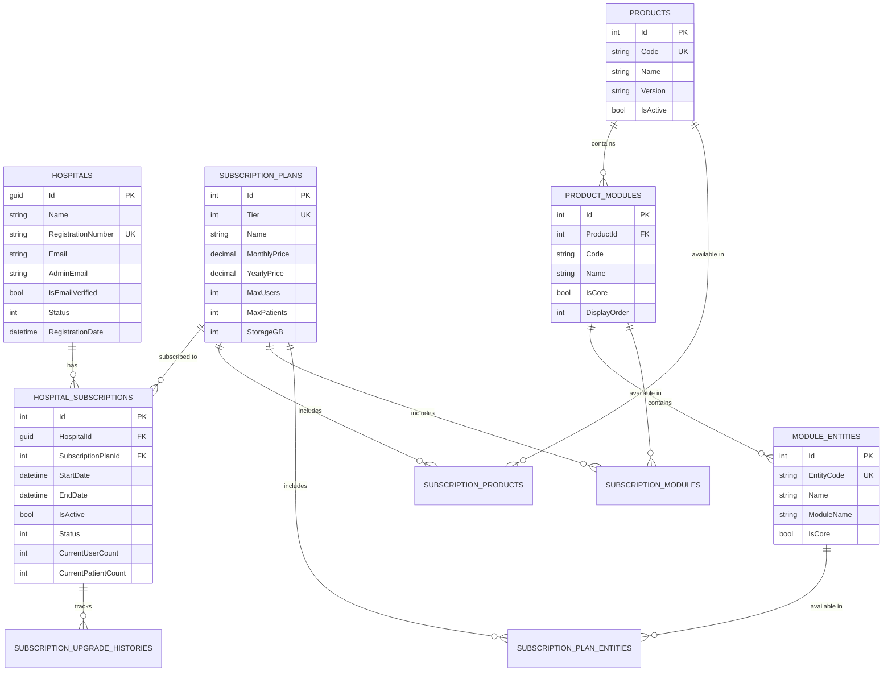

# MedWay Subscription Management System
## Complete Architecture & Implementation Guide

---

## 📋 **Table of Contents**
1. [Overview](#overview)
2. [Database Schema](#database-schema)
3. [Entity Relationship Diagram](#entity-relationship-diagram)
4. [Data Models](#data-models)
5. [Service Layer](#service-layer)
6. [API Endpoints](#api-endpoints)
7. [UI Components](#ui-components)
8. [Implementation Steps](#implementation-steps)
9. [Testing Guide](#testing-guide)
10. [Deployment](#deployment)

---

## 🎯 **Overview**

The MedWay Subscription Management System is a comprehensive, production-ready solution for managing **product-based subscriptions** in a healthcare management platform. It supports:

- **Multi-tier subscriptions** (Trial, Standard, Gold, Platinum)
- **Product-Module-Entity hierarchy** for granular feature control
- **Dynamic access control** based on active subscription
- **Usage tracking** and limit enforcement
- **Subscription lifecycle management** (creation, upgrade, downgrade, renewal, cancellation)
- **Billing integration hooks** for payment gateways
- **Multi-tenancy** support for multiple hospitals

### **Technical Stack**
- **Backend**: .NET 10, C#, Entity Framework Core
- **Database**: SQL Server (primary) / PostgreSQL (alternative)
- **UI**: Blazor Server with Syncfusion components
- **Architecture**: Clean Architecture with DDD principles

---

## 🗄️ **Database Schema**

### **Core Tables**

#### **1. Hospitals** (Core Entity)
```sql
CREATE TABLE Hospitals (
    Id UNIQUEIDENTIFIER PRIMARY KEY DEFAULT NEWID(),
    Name NVARCHAR(200) NOT NULL,
    RegistrationNumber NVARCHAR(50) NOT NULL UNIQUE,
    Address NVARCHAR(500),
    City NVARCHAR(100),
    State NVARCHAR(100),
    Country NVARCHAR(100),
    PostalCode NVARCHAR(20),
    PhoneNumber NVARCHAR(20),
    Email NVARCHAR(100) NOT NULL,
    Website NVARCHAR(200),
    AdminName NVARCHAR(100),
    AdminEmail NVARCHAR(100) NOT NULL,
    AdminPhone NVARCHAR(20),
    IsEmailVerified BIT NOT NULL DEFAULT 0,
    Status INT NOT NULL DEFAULT 0, -- 0: Pending, 1: Approved, 2: Rejected, 3: Active, 4: Inactive
    RegistrationDate DATETIME2 NOT NULL DEFAULT GETUTCDATE(),
    
    INDEX IX_Hospitals_RegistrationNumber (RegistrationNumber),
    INDEX IX_Hospitals_Email (Email),
    INDEX IX_Hospitals_Status (Status)
);
```

#### **2. Products** (Top-level Product Definition)
```sql
CREATE TABLE Products (
    Id INT PRIMARY KEY IDENTITY(1,1),
    Name NVARCHAR(200) NOT NULL,
    Code NVARCHAR(50) NOT NULL UNIQUE,
    Description NVARCHAR(MAX),
    Version NVARCHAR(20) DEFAULT '1.0.0',
    IsActive BIT NOT NULL DEFAULT 1,
    CreatedAt DATETIME2 NOT NULL DEFAULT GETUTCDATE(),
    UpdatedAt DATETIME2,
    
    INDEX IX_Products_Code (Code),
    INDEX IX_Products_IsActive (IsActive)
);
```

#### **3. ProductModules** (Modules within Products)
```sql
CREATE TABLE ProductModules (
    Id INT PRIMARY KEY IDENTITY(1,1),
    ProductId INT NOT NULL,
    Name NVARCHAR(100) NOT NULL,
    Code NVARCHAR(50) NOT NULL,
    Description NVARCHAR(MAX),
    Icon NVARCHAR(50),
    DisplayOrder INT DEFAULT 0,
    IsCore BIT NOT NULL DEFAULT 1,
    IsActive BIT NOT NULL DEFAULT 1,
    CreatedAt DATETIME2 NOT NULL DEFAULT GETUTCDATE(),
    
    FOREIGN KEY (ProductId) REFERENCES Products(Id) ON DELETE CASCADE,
    INDEX IX_ProductModules_ProductId_Code (ProductId, Code) UNIQUE,
    INDEX IX_ProductModules_IsActive (IsActive)
);
```

#### **4. ModuleEntities** (Features/Entities within Modules)
```sql
CREATE TABLE ModuleEntities (
    Id INT PRIMARY KEY IDENTITY(1,1),
    Name NVARCHAR(100) NOT NULL,
    EntityCode NVARCHAR(50) NOT NULL UNIQUE,
    ModuleName NVARCHAR(50) NOT NULL,
    Description NVARCHAR(MAX),
    IsCore BIT NOT NULL DEFAULT 1,
    CreatedAt DATETIME2 NOT NULL DEFAULT GETUTCDATE(),
    
    INDEX IX_ModuleEntities_EntityCode (EntityCode),
    INDEX IX_ModuleEntities_ModuleName (ModuleName),
    INDEX IX_ModuleEntities_IsCore (IsCore)
);
```

#### **5. SubscriptionPlans** (Subscription Tier Definitions)
```sql
CREATE TABLE SubscriptionPlans (
    Id INT PRIMARY KEY IDENTITY(1,1),
    Tier INT NOT NULL UNIQUE, -- 0: Trial, 1: Standard, 2: Gold, 3: Platinum
    Name NVARCHAR(100) NOT NULL,
    Description NVARCHAR(MAX),
    MonthlyPrice DECIMAL(18,2) NOT NULL,
    YearlyPrice DECIMAL(18,2) NOT NULL,
    MaxUsers INT NOT NULL, -- -1 for unlimited
    MaxPatients INT NOT NULL, -- -1 for unlimited
    HasAdvancedReports BIT NOT NULL DEFAULT 0,
    HasAPIAccess BIT NOT NULL DEFAULT 0,
    Has24x7Support BIT NOT NULL DEFAULT 0,
    HasCustomBranding BIT NOT NULL DEFAULT 0,
    StorageGB INT NOT NULL,
    IsActive BIT NOT NULL DEFAULT 1,
    CreatedAt DATETIME2 NOT NULL DEFAULT GETUTCDATE(),
    UpdatedAt DATETIME2,
    
    INDEX IX_SubscriptionPlans_Tier (Tier),
    INDEX IX_SubscriptionPlans_IsActive (IsActive)
);
```

#### **6. HospitalSubscriptions** (Active Subscriptions)
```sql
CREATE TABLE HospitalSubscriptions (
    Id INT PRIMARY KEY IDENTITY(1,1),
    HospitalId UNIQUEIDENTIFIER NOT NULL,
    SubscriptionPlanId INT NOT NULL,
    StartDate DATETIME2 NOT NULL DEFAULT GETUTCDATE(),
    EndDate DATETIME2 NOT NULL,
    IsActive BIT NOT NULL DEFAULT 1,
    AutoRenew BIT NOT NULL DEFAULT 1,
    IsYearlyBilling BIT NOT NULL DEFAULT 0,
    LastBillingDate DATETIME2,
    NextBillingDate DATETIME2,
    
    -- Usage Tracking
    CurrentUserCount INT NOT NULL DEFAULT 0,
    CurrentPatientCount INT NOT NULL DEFAULT 0,
    CurrentStorageUsedGB DECIMAL(18,2) NOT NULL DEFAULT 0,
    
    -- Status
    Status INT NOT NULL DEFAULT 0, -- 0: Active, 1: Expired, 2: Cancelled, 3: Suspended, 4: PendingPayment, 5: TrialEnded
    CreatedAt DATETIME2 NOT NULL DEFAULT GETUTCDATE(),
    UpdatedAt DATETIME2,
    CancelledAt DATETIME2,
    CancellationReason NVARCHAR(500),
    
    -- Trial Information
    IsTrial BIT NOT NULL DEFAULT 0,
    TrialStartDate DATETIME2,
    TrialEndDate DATETIME2,
    
    FOREIGN KEY (HospitalId) REFERENCES Hospitals(Id) ON DELETE CASCADE,
    FOREIGN KEY (SubscriptionPlanId) REFERENCES SubscriptionPlans(Id),
    INDEX IX_HospitalSubscriptions_HospitalId_Status (HospitalId, Status),
    INDEX IX_HospitalSubscriptions_EndDate (EndDate)
);
```

#### **7. SubscriptionUpgradeHistories** (Upgrade/Downgrade Tracking)
```sql
CREATE TABLE SubscriptionUpgradeHistories (
    Id INT PRIMARY KEY IDENTITY(1,1),
    HospitalSubscriptionId INT NOT NULL,
    FromPlanId INT NOT NULL,
    ToPlanId INT NOT NULL,
    ChangeDate DATETIME2 NOT NULL DEFAULT GETUTCDATE(),
    Reason NVARCHAR(500),
    ProrationAmount DECIMAL(18,2) NOT NULL DEFAULT 0,
    ChangedBy NVARCHAR(100),
    
    FOREIGN KEY (HospitalSubscriptionId) REFERENCES HospitalSubscriptions(Id) ON DELETE CASCADE,
    FOREIGN KEY (FromPlanId) REFERENCES SubscriptionPlans(Id),
    FOREIGN KEY (ToPlanId) REFERENCES SubscriptionPlans(Id),
    INDEX IX_SubscriptionUpgradeHistories_ChangeDate (ChangeDate)
);
```

### **Mapping Tables** (Many-to-Many Relationships)

#### **8. SubscriptionProducts** (Products available in each Plan)
```sql
CREATE TABLE SubscriptionProducts (
    Id INT PRIMARY KEY IDENTITY(1,1),
    SubscriptionPlanId INT NOT NULL,
    ProductId INT NOT NULL,
    IsEnabled BIT NOT NULL DEFAULT 1,
    AddedAt DATETIME2 NOT NULL DEFAULT GETUTCDATE(),
    
    FOREIGN KEY (SubscriptionPlanId) REFERENCES SubscriptionPlans(Id) ON DELETE CASCADE,
    FOREIGN KEY (ProductId) REFERENCES Products(Id) ON DELETE CASCADE,
    INDEX IX_SubscriptionProducts_SubscriptionPlanId_ProductId (SubscriptionPlanId, ProductId) UNIQUE
);
```

#### **9. SubscriptionModules** (Modules available in each Plan)
```sql
CREATE TABLE SubscriptionModules (
    Id INT PRIMARY KEY IDENTITY(1,1),
    SubscriptionPlanId INT NOT NULL,
    ProductModuleId INT NOT NULL,
    IsEnabled BIT NOT NULL DEFAULT 1,
    AddedAt DATETIME2 NOT NULL DEFAULT GETUTCDATE(),
    
    FOREIGN KEY (SubscriptionPlanId) REFERENCES SubscriptionPlans(Id) ON DELETE CASCADE,
    FOREIGN KEY (ProductModuleId) REFERENCES ProductModules(Id) ON DELETE CASCADE,
    INDEX IX_SubscriptionModules_SubscriptionPlanId_ProductModuleId (SubscriptionPlanId, ProductModuleId) UNIQUE
);
```

#### **10. SubscriptionPlanEntities** (Entities available in each Plan)
```sql
CREATE TABLE SubscriptionPlanEntities (
    Id INT PRIMARY KEY IDENTITY(1,1),
    SubscriptionPlanId INT NOT NULL,
    ModuleEntityId INT NOT NULL,
    IsEnabled BIT NOT NULL DEFAULT 1,
    AddedAt DATETIME2 NOT NULL DEFAULT GETUTCDATE(),
    
    FOREIGN KEY (SubscriptionPlanId) REFERENCES SubscriptionPlans(Id) ON DELETE CASCADE,
    FOREIGN KEY (ModuleEntityId) REFERENCES ModuleEntities(Id) ON DELETE CASCADE,
    INDEX IX_SubscriptionPlanEntities_SubscriptionPlanId_ModuleEntityId (SubscriptionPlanId, ModuleEntityId) UNIQUE
);
```

---

## 📊 **Entity Relationship Diagram**



---

## 📦 **Predefined Data**

### **Subscription Plans**

| Tier | Name | Monthly | Yearly | Max Users | Max Patients | Storage | Features |
|------|------|---------|--------|-----------|--------------|---------|----------|
| **Trial** | Trial Plan | $0 | $0 | 5 | 100 | 5 GB | Basic features only, 30-day limit |
| **Standard** | Standard Plan | $99.99 | $999.99 | 20 | 1,000 | 50 GB | Core features, basic reports |
| **Gold** | Gold Plan | $249.99 | $2,499.99 | 50 | 5,000 | 200 GB | Advanced reports, API access, custom branding |
| **Platinum** | Platinum Plan | $499.99 | $4,999.99 | Unlimited | Unlimited | 1 TB | All features, 24/7 support, priority access |

### **Entity Count by Tier**

- **Trial**: 14 entities (core only)
- **Standard**: 23 entities (core + essential)
- **Gold**: 42 entities (core + advanced)
- **Platinum**: 45 entities (all features)

### **Module Entities (45 total)**

#### **Dashboard Module** (4 entities)
- `DASH_OVERVIEW` - Basic dashboard (Core)
- `DASH_ANALYTICS` - Advanced analytics
- `DASH_REALTIME` - Real-time monitoring
- `DASH_CUSTOM` - Custom dashboards (Platinum)

#### **Patient Management** (6 entities)
- `PAT_REGISTER` - Patient registration (Core)
- `PAT_RECORDS` - Medical records (Core)
- `PAT_HISTORY` - Patient history
- `PAT_DOCUMENTS` - Document management
- `PAT_INSURANCE` - Insurance management
- `PAT_FAMILY` - Family tree

#### **Appointments** (6 entities)
- `APPT_SCHEDULE` - Scheduling (Core)
- `APPT_CALENDAR` - Calendar view (Core)
- `APPT_ONLINE` - Online booking
- `APPT_REMINDER` - SMS/Email reminders
- `APPT_WAITLIST` - Waiting list
- `APPT_VIDEO` - Video consultation

#### **Billing** (6 entities)
- `BILL_INVOICE` - Invoice generation (Core)
- `BILL_PAYMENT` - Payment processing (Core)
- `BILL_INSURANCE` - Insurance claims
- `BILL_REPORTS` - Financial reports
- `BILL_ONLINE` - Online payment gateway
- `BILL_INSTALLMENT` - Installment plans

#### **Inventory** (6 entities)
- `INV_STOCK` - Stock management (Core)
- `INV_PURCHASE` - Purchase orders
- `INV_SUPPLIER` - Supplier management
- `INV_EXPIRY` - Expiry tracking
- `INV_BARCODE` - Barcode system
- `INV_ANALYTICS` - Inventory analytics

#### **Reports** (5 entities)
- `REP_BASIC` - Basic reports (Core)
- `REP_CUSTOM` - Custom reports
- `REP_SCHEDULED` - Scheduled reports
- `REP_EXPORT` - Advanced export (Excel, PDF, CSV)
- `REP_DASHBOARD` - Report dashboards

#### **Settings** (6 entities)
- `SET_PROFILE` - Hospital profile (Core)
- `SET_DEPARTMENTS` - Department setup (Core)
- `SET_ROLES` - Role management
- `SET_WORKFLOW` - Workflow customization
- `SET_INTEGRATION` - Third-party integration
- `SET_BACKUP` - Backup & restore (Platinum)

#### **User Management** (5 entities)
- `USER_MANAGE` - User management (Core)
- `USER_PERMISSIONS` - Permission control (Core)
- `USER_AUDIT` - Audit logs
- `USER_SSO` - Single Sign-On
- `USER_2FA` - Two-Factor Authentication

---

## ✅ **Implementation Complete**

### **Files Created:**

1. **Models** (7 files)
   - `ModuleEntity.cs` - Entity definitions and predefined data
   - `SubscriptionPlan.cs` - Plan definitions with pricing
   - `SubscriptionPlanEntity.cs` - Plan-entity mappings
   - `HospitalSubscription.cs` - Subscription management
   - `Product.cs` - Product and module hierarchy
   
2. **Data Layer**
   - `ApplicationDbContext.cs` - EF Core database context with full configuration

3. **Service Layer**
   - `SubscriptionService.cs` - Comprehensive subscription management service

4. **Configuration**
   - `Program.cs` - Updated with DbContext registration
   - `appsettings.json` - Connection strings for SQL Server/PostgreSQL
   - `SimpleMedWayDemo.csproj` - EF Core packages added

---

## 🚀 **Next Steps**

### **1. Build and Run**

```powershell
# Restore packages
cd /Users/kanagasubramaniankrishnamurthi/Documents/Nalam360EnterprisePlatform2.0/MedWayHealthCare2.0/src/Presentation/SimpleMedWayDemo
dotnet restore

# Build
dotnet build

# Run application (database will be created automatically)
dotnet run
```

### **2. Verify Database Creation**

The database will be automatically created on first run with all seed data including:
- 4 subscription plans (Trial, Standard, Gold, Platinum)
- 45 module entities across 8 modules
- All subscription-entity mappings

### **3. Create Admin UI** (Next Phase)

Create Blazor pages for:
- Subscription plan selection
- Current subscription dashboard
- Usage tracking
- Upgrade/downgrade flows
- Subscription history

---

## 📝 **Key Features Implemented**

✅ **Product-Module-Entity Hierarchy**
✅ **Multi-tier Subscription System**
✅ **Access Control Service**
✅ **Usage Tracking & Limits**
✅ **Subscription Lifecycle Management**
✅ **Upgrade/Downgrade with Proration**
✅ **Trial Period Support**
✅ **Auto-renewal**
✅ **SQL Server + PostgreSQL Support**
✅ **Seed Data with 45 Entities**
✅ **EF Core Migrations Ready**

---

**For questions or issues, refer to the service documentation in `SubscriptionService.cs`**
